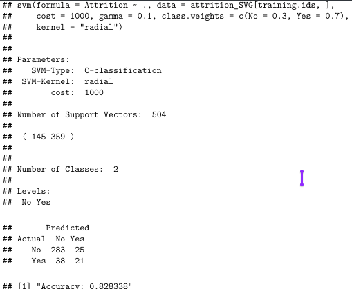

<br/>
<p align="center">
  <a href="https://github.com/jenkins96/SVM-Attrition">
    
  </a>

  <h3 align="center">SVM Model - Predicting Attrition</h3>

  <p align="center">
    Every Project Teach Us Something!
    <br/>
    <br/>
    <a href="https://github.com/jenkins96/SVM-Attrition/issues">Report Bug</a>
    .
  </p>
</p>

  

## Table Of Contents

* [About the Project](#about-the-project)
* [Built With](#built-with)
* [Getting Started](#getting-started)
  * [Prerequisites](#prerequisites)
  * [Installation](#installation)
* [Authors](#authors)

## About The Project
SVM model.  
Dependent variable: "Attrition".  
Metric to prioritize: recall.  
[Data set was obtained from IBM HR Analytics Employee Attrition & Performance](https://www.kaggle.com/pavansubhasht/ibm-hr-analytics-attrition-dataset)
  

  
## Built With
* R
* RStudio
* Tidyverse
* Caret
* e1071
* Magrittr

## Getting Started
Just explore the html or pdf file. Of course you can look at the code in the "script.R" file and "SMV-Attrition.Rmd" file.

### Prerequisites
None if you just want to look at the output. Just download the whole directory and then open “EDA.html” file or alternatively you can just download the pdf file. If you want to modify or experiment with the code you should have R base and hopefully RStudio installed.

### Installation

1. Clone the repo

```sh
git clone https://github.com/jenkins96/SVM-Attrition.git
```

2. Open R Project: "SVM-Attrition.Rproj".
  
3. Install and load the required libraries Script comes with function for installing and loading libraries if needed. 

## Authors

* **Adrian Jenkins** - ** - [Adrian Jenkins](https://github.com/jenkins96/) - **
